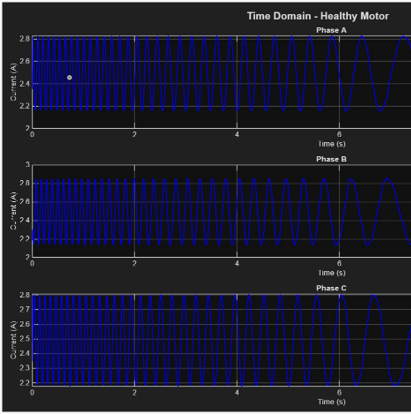
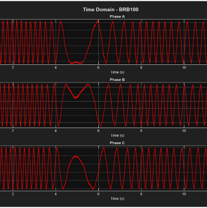
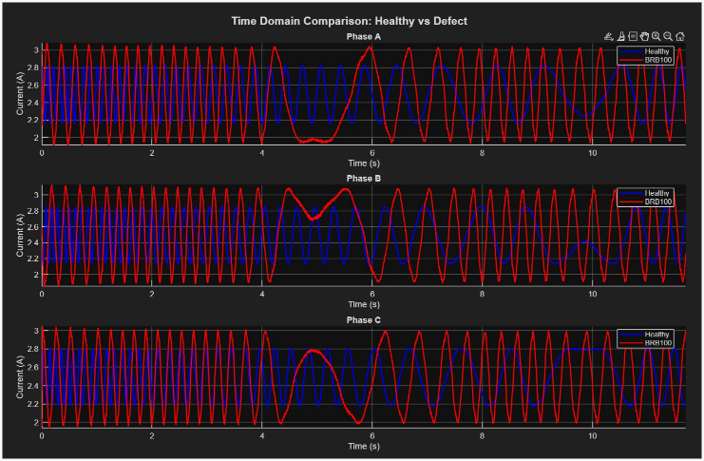

# Motor Fault Classification using Machine Learning

## 📌 Project Overview
This project implements a machine learning-based condition monitoring system for a three-phase induction motor using current signal analysis and FFT-based feature extraction.

It detects motor faults using both time-domain and frequency-domain signal processing techniques.

---

## ⚙️ Motor Specifications
- **Type:** Three-phase induction motor  
- **Sampling rate:** 10,000 Hz  
- **Data:** Current signals from Phase A, B, and C  

---

## 📊 Dataset Description
The dataset contains 9 classes:
- Healthy  
- BRB100, BRB300  
- BFI100, BFI200, BFI300  
- BFO100, BFO200, BFO300  

*Each CSV file contains time samples (rows) and 3-phase current data (columns).*

---

## 🔍 Signal Analysis
We visualize the current signals to identify distinct patterns between states:

**Healthy Motor Signals** 

**Broken Rotor Bar (BRB) Fault Signal** 

**Direct Comparison: Healthy vs. Defect** 

---

## 🧠 Feature Extraction

### Time Domain
- Mean, RMS, standard deviation
- Signal amplitude behavior

### Frequency Domain (FFT)
**Focused frequency range:** 40–70 Hz

**Extracted features:**
- Peak magnitude
- Mean magnitude
- Supply frequency (50 Hz) magnitude
- Sideband asymmetry
- Bearing fault frequency bands (100–400 Hz)

---

## 🤖 Machine Learning Models Used
- Naive Bayes, Decision Tree, Linear Discriminant Analysis, KNN, Random Forest, AdaBoost, Quadratic Discriminant Analysis.

---

## 🏆 Results
Our comparative analysis shows that **Random Forest** and **KNN** provide the highest classification accuracy, achieving **99.95%**.

### Visual Results
**Confusion Matrix** 

**FFT Frequency Analysis** 

### Performance Metrics
**Model Accuracy Comparison** 

**Detailed Classification Metrics** 

### Key Achievements

---

## 🔬 Key Insight
Fault detection is most effective in:
- 40–70 Hz range (supply frequency region)
- 100–400 Hz range (bearing fault harmonics)

---

## 🚀 Future Improvements
- CNN / LSTM deep learning models  
- Multi-sensor fusion (vibration + thermal + current)  
- Edge AI deployment  
- Explainable AI (SHAP / LIME)

---

## 👨‍💻 Author
Electrical Engineering student working on AI-based industrial fault diagnosis systems.
