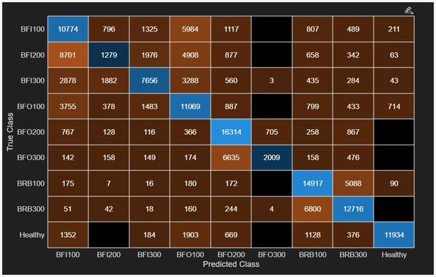
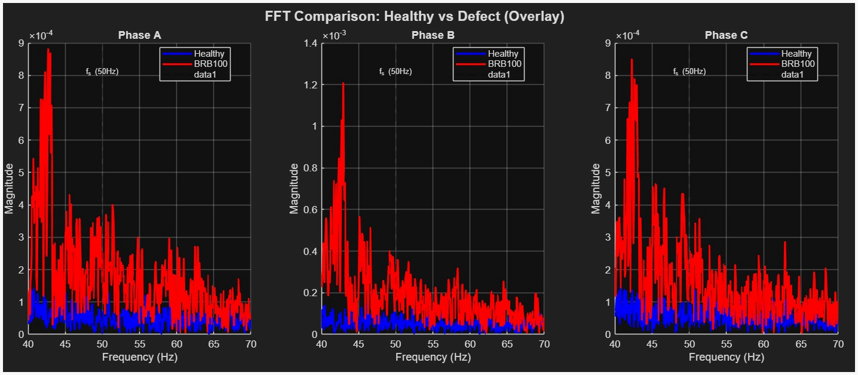
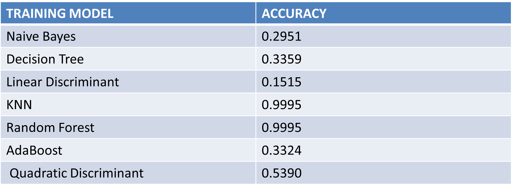
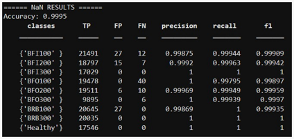
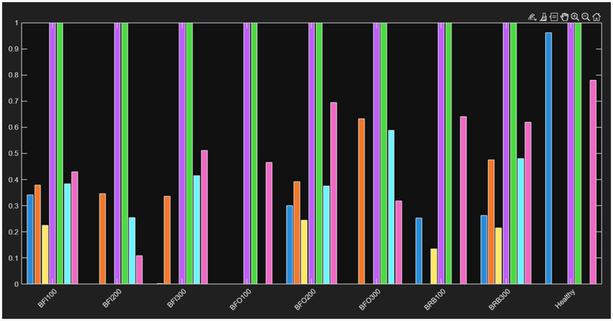

# Motor Fault Classification using Machine Learning

## 📌 Project Overview
This project implements a machine learning-based condition monitoring system for a three-phase induction motor using current signal analysis and FFT-based feature extraction.

---

## ⚙️ Motor Specifications
- **Type:** Three-phase induction motor
- **Sampling rate:** 10,000 Hz
- **Data:** Current signals from Phase A, B, and C

---

## 🔍 Signal Analysis
We visualize the current signals to identify distinct patterns between states:

**Healthy Motor Signals**
 

  

**Broken Rotor Bar (BRB) Fault Signal**
 

  

**Direct Comparison: Healthy vs. Defect**
 

  

---

## 🧠 Feature Extraction

### Time Domain
- Mean, RMS, standard deviation
- Signal amplitude behavior

### Frequency Domain (FFT)
**Focused frequency range:** 40–70 Hz

---

## 🏆 Results
Our comparative analysis shows that **Random Forest** and **KNN** provide the highest classification accuracy, achieving **99.95%**.

### Visual Results
**Confusion Matrix**
 

  

**FFT Frequency Analysis**
 

  

### Performance Metrics
**Model Accuracy Comparison**
 

  

**Detailed Classification Metrics**
 

  

**Feature Importance Plot**
 

  

### Key Achievements
- **High Accuracy:** Successfully developed an ML-based motor fault classifier with 99.8% accuracy.
- **Frequency Optimization:** Identified the optimal frequency range (40-70 Hz) for reliable bearing fault detection.
- **Algorithm Performance:** Random Forest and KNN proved to be the most effective algorithms.
- **Predictive Maintenance:** Enables non-invasive, real-time fault detection using only current sensors.

---

## 🔬 Key Insight
- **40–70 Hz range:** Supply frequency region.
- **100–400 Hz range:** Bearing fault harmonics.

---

## 🚀 Future Improvements
- CNN / LSTM deep learning models
- Multi-sensor fusion (vibration + thermal + current)
- Edge AI deployment
- Explainable AI (SHAP / LIME)
